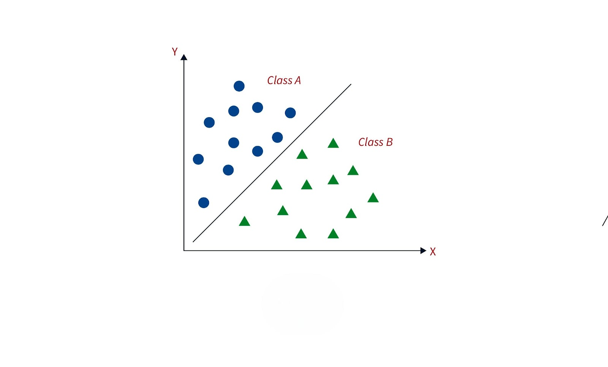
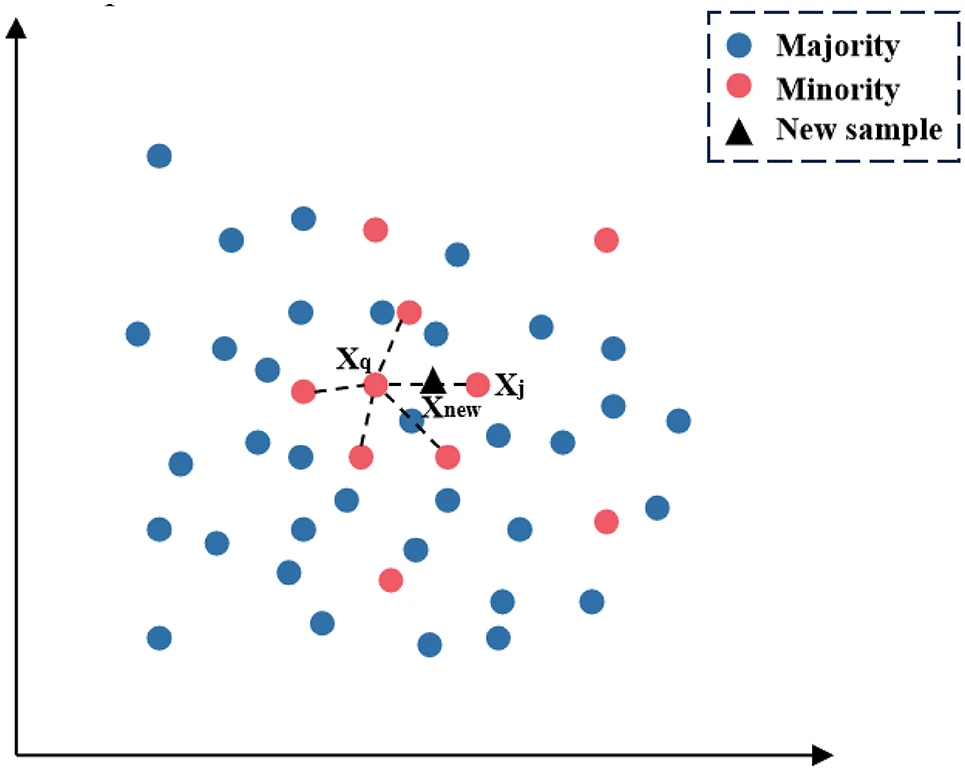
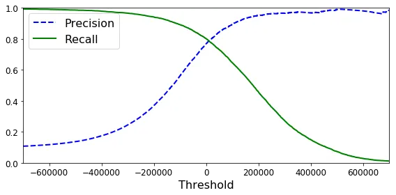
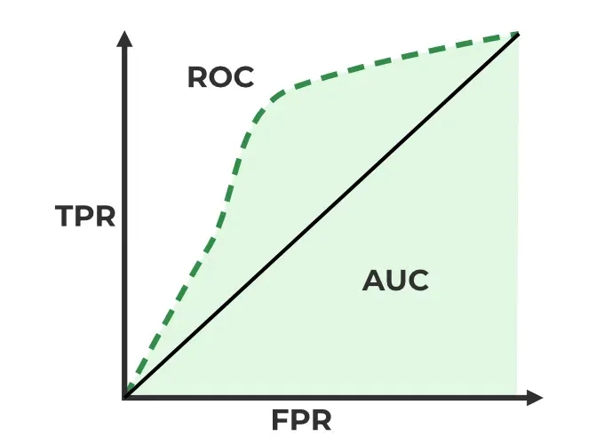
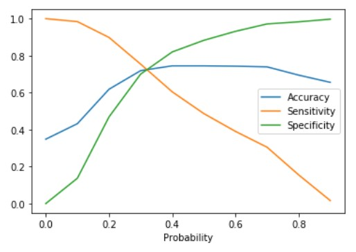

# ML Classification

Have you ever wondered how spam emails are detected, why some loan requests get rejected, or how Google Images can accurately recognize objects?
All of these are real-world applications of classification in Machine Learning.

In this section, we’ll explore what classification means, how to build a simple classification model, and the key metrics used to evaluate its performance.

## What is Classification?

In simple terms, classification is a type of supervised machine learning.

Supervised learning means the model is trained with labeled data, i.e., input features are provided along with their corresponding output labels.

- If the output variable is continuous, the task is called regression.

- If the output variable is categorical, the task is called classification.

## Types of Classification

1 .Binary Classification

  - The output has only two possible categories.

Example: Approving or rejecting a loan, or detecting whether an email is spam or not.

2. Multi-class Classification

 - The output has more than two discrete categories.

Example: Classifying different types of skin diseases.

## Classification Intuition

Let’s consider binary classification. Suppose we plot all the data points on a graph. If it is possible to draw a line that separates the two classes, then this line can be used to distinguish between the two possible outcomes.

Since this line separates the dataset into two distinct groups, we can think of it as a decision boundary or a simple model that differentiates the data points.

In linear regression, we fit a regression line by minimizing the Mean Squared Error (MSE). However, in classification, this approach faces challenges because:

A straight line may separate classes but does not give us the probability of a point belonging to a particular class.

Classification problems require not just a boundary, but also a way to estimate probabilities and handle overlapping points.

This is where models like Logistic Regression come into play, as they help estimate probabilities while drawing effective decision boundaries.

## Logistic Regression

Unlike linear regression, which predicts continuous values, logistic regression applies a sigmoid function to map predictions into a range between 0 and 1.

This output can then be interpreted as the probability of a data point belonging to a certain class.

By setting a threshold (commonly 0.5), we can classify whether a point belongs to Class 0 or Class 1.

## Data Imbalance

One of the most important issues in classification problems is data imbalance. For example, imagine we have a dataset where 95% of the samples belong to one class and only 5% belong to the other class. If we train a model on this dataset and see an accuracy of 95%, does that mean the model is good?

Not necessarily. Accuracy can be misleading in imbalanced datasets. In this scenario, the model could simply predict the majority class for every input and still achieve high accuracy, while completely ignoring the minority class. Behind the scenes, the model might have learned nothing about the smaller class, which can be critical depending on the application (e.g., fraud detection, disease diagnosis).

To properly evaluate models on imbalanced data, we should use metrics like:

- Precision, Recall, F1-score – to measure performance on each class separately
- Confusion Matrix – to visualize how many samples of each class are correctly or incorrectly classified
- ROC-AUC – to evaluate the model’s discriminative ability

We’ll discuss these metrics later, but for now, let’s look at the ways to address data imbalance.

## Data Imbalace Techniques

There are different techniques to tackle data imbalance problems. Some of them are:

### Random Undersampling

In this technique, instead of increasing the minority class, we reduce the number of samples in the majority class so that the dataset becomes more balanced.

- Disadvantages:
  - Important information from the majority class may be lost, which can affect model performance.
 
### Random Oversampling

In this technique, we increase the number of samples in the minority class, often by duplicating existing data points, to balance the dataset.

- Disadvantage:
  - It can reduce the originality of the data, as no new unique information is added, which may lead to overfitting
 
### Synthetic Minority Oversampling Technique (SMOTE)

In this technique, new synthetic samples for the minority class are generated based on the similarity between existing minority class samples.

- Instead of simply duplicating data, SMOTE creates new, slightly different data points to help balance the dataset.
- Advantage: Helps the model learn better patterns from the minority class without overfitting to duplicates.
- Disadvantage: May generate samples that overlap with the majority class, potentially introducing some noise.

### Adaptive Synthetic Sampling Method (ADASYN)

It is similar to SMOTE , but is more focused on the minority dataset which are hard to detect
- Advantage : Helps the model pay more attention to difficult cases, improving learning for the minority class.
- Disadvantage: Can introduce noise if too many synthetic samples are generated in sparse regions, potentially affecting model accuracy.

### SMOTETomek (Oversampling followed by Undersampling)

SMOTETomek is a hybrid technique that combines SMOTE oversampling with Tomek link undersampling:

SMOTE: First, synthetic minority class samples are generated to balance the dataset.

Tomek Links: Then, Tomek links (pairs of nearest neighbor samples from opposite classes that are very close) are removed, usually from the majority class. This cleans overlapping samples and reduces class ambiguity.

- Advantage: Balances the dataset while removing noisy or overlapping majority samples, improving model performance.

- Disadvantage: Slightly more complex and may remove some useful majority class samples if not applied carefully.

## Metrics

So far, we have focused on the steps required before building a model. Once the model is built, we need metrics to evaluate its performance. Since we are dealing with classification problems, the outputs are discrete.

Most people are familiar with accuracy, which is the basic metric everyone knows. However, there are several other important metrics that are often overlooked, and we will discuss a few of them here.

### Confusion Matrix
Every classification metric is derived from the confusion matrix, which is simply a table that compares the model’s predicted values with the actual values.

  

- True Positive (TP): The number of samples that are actually positive and are correctly predicted as positive.
- True Negative (TN): The number of samples that are actually negative and are correctly predicted as negative.
- False Positive (FP): The number of samples that are actually negative but are incorrectly predicted as positive.
- False Negative (FN): The number of samples that are actually positive but are incorrectly predicted as negative.

The confusion matrix provides the foundation for other metrics such as Precision, Recall, F1-score, and Accuracy.

### Accuracy 

It measures the overall performance of a classification model by calculating the proportion of correctly predicted samples (both positive and negative) out of all predictions.

$$
\text{Accuracy} = \frac{TP + TN}{TP + TN + FP + FN}
$$

- Importance: Accuracy gives a quick overview of how well your model is performing overall.
- Limitation: Can be misleading in imbalanced datasets. For example, if 95% of samples belong to one class, a model that predicts only that class will still have 95% accuracy but fail on the minority class.
- Use case: Works best when classes are balanced.

### Precision

It measures the proportion of correctly predicted positive samples out of all predicted positives.

$$
\text{Precision} = \frac{TP}{TP + FP}
$$

- Importance: Measures how many of the predicted positive cases are actually correct.
- When to use: When false positives are costly.

Example : 

Your model predicts 50 patients as having the disease.
Out of those, 45 actually have the disease (True Positives) and 5 are healthy patients wrongly diagnosed (False Positives).

$$
\text{Precision} = \frac{45}{45 + 5} = 0.9
$$

Interpretation: 90% of the patients the model flagged as diseased actually have the disease.

Importance: High precision avoids unnecessary treatments or anxiety for healthy patients.

### Recall / Sensitivity / True Positive Rate

Recall measures the proportion of correctly predicted positive samples out of all actual positives.

$$
\text{Recall} = \frac{TP}{TP + FN}
$$

- Importance: Measures how many actual positive cases the model correctly identifies.
- When to use: When missing positive cases is costly.

Example:
There are 60 patients who actually have the disease.

Your model correctly identifies 45 (TP) but misses 15 patients (False Negatives).

$$
\text{Recall} = \frac{45}{45 + 15} = 0.75
$$

Interpretation: The model detected 75% of all patients who truly have the disease.

Importance: High recall reduces the risk of missing sick patients, which can be life-threatening

### Specificity / True Negative Rate

Specificity measures the proportion of correctly predicted negative samples out of all actual negatives.

$$
\text{Specificity} = \frac{TN}{TN + FP}
$$

- Importance: Measures how many actual negative cases are correctly identified.
- When to use: When false positives are a concern.

Example : Suppose we have 100 healthy patients.

The model correctly identifies 90 of them as healthy (True Negatives, TN) but incorrectly flags 10 as sick (False Positives, FP).

$$
\text{Specificity} = \frac{90}{90 + 10} = 0.9
$$

Interpretation: The model correctly identifies 90% of healthy patients.

Importance in medicine: High specificity is crucial when avoiding unnecessary treatments or anxiety for healthy patients.

### True Positive Rate (TPR)

TPR is the same as **recall/sensitivity**. It measures the proportion of actual positives correctly identified.

$$
\text{TPR} = \frac{TP}{TP + FN}
$$

- Use case: Evaluating sensitivity of the model in detecting important events.

### False Positive Rate (FPR)

FPR measures the proportion of negative samples that are incorrectly predicted as positive.

$$
\text{FPR} = \frac{FP}{FP + TN}
$$

- Importance: Measures how often the model incorrectly predicts positives.

## Precision-Recall Trade-off Diagram / F1-Score

When working with medical data, we want both high Recall (to avoid missing sick patients) and high Precision (to avoid misdiagnosing healthy patients). However, if we plot a graph of Precision versus Recall, we often see that they contradict each other—improving one can reduce the other. Therefore, we need an optimal cutoff that balances both concerns. This is where the F1-score becomes important.

The F1-score is the harmonic mean of Precision and Recall, providing a single metric that balances these two aspects:

$$
F1 = 2 \cdot \frac{\text{Precision} \times \text{Recall}}{\text{Precision} + \text{Recall}}
$$

  

### ROC (Receiver Operating Characteristic) curve

The ROC curve is a graphical representation that shows the trade-off between the True Positive Rate (TPR / Recall / Sensitivity) and the False Positive Rate (FPR = 1 – Specificity) across different classification thresholds.

- Goal: For an ideal model, we want the TPR to be as high as possible while keeping the FPR as low as possible.
- Ideal case: TPR = 1, FPR = 0

After plotting TPR vs FPR for various thresholds, we calculate the Area Under the Curve (AUC):

- AUC close to 1: Excellent model performance
- AUC ≈ 0.5: Model performs no better than random guessing

The ROC curve is especially useful in imbalanced datasets or when different thresholds need to be evaluated, such as in medical diagnosis, fraud detection, or risk assessment.

  

## Other Tradeoff

we can also draw the trade off for accuracy, sensitivity and specificity

  

